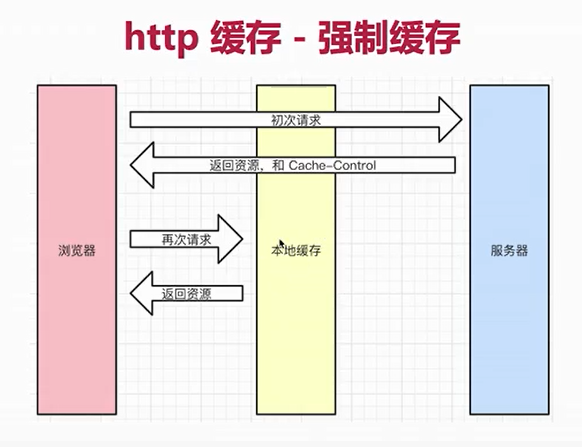
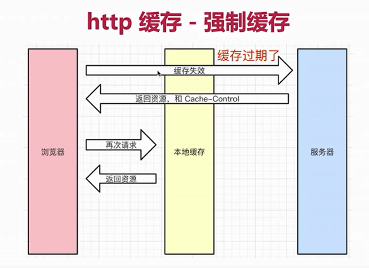
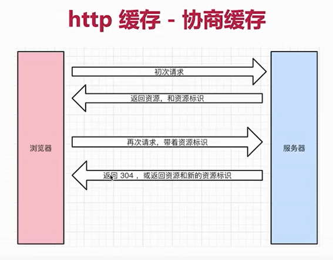
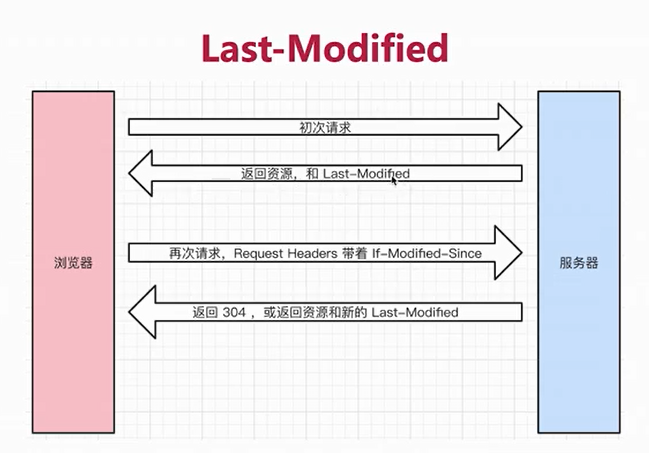
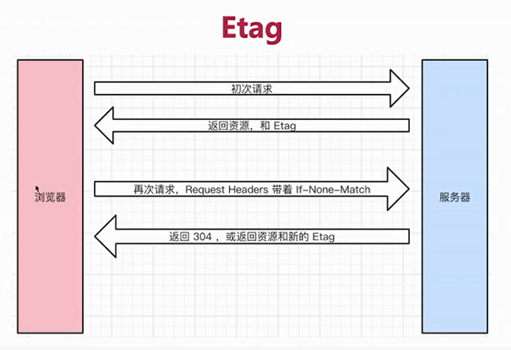
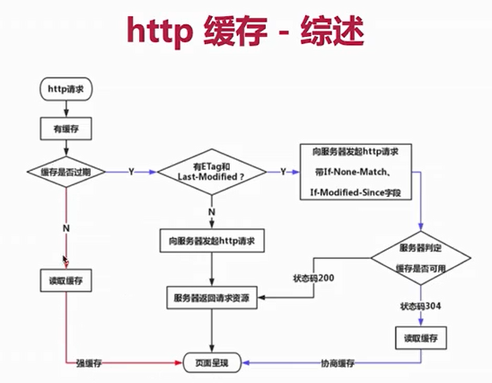

## http 状态码

- 状态码分类
    - 1xx 服务器收到请求
    - 2xx 请求成功，如 200
    - 3xx 重定向，如 302
    - 4xx 客户端错误，如 404
    - 5xx 服务端错误，如 500

- 常见状态码
    - 200 成功
    - 301 永久重定向（配合 location ，浏览器自动处理）
    - 302 临时重定向（配合 location， 浏览器自动处理）
    - 304 资源未被修改
    - 403 没有权限
    - 404 资源未找到
    - 500 服务端错误
    - 504 网关超时
    
- 关于协议和规范
    - 就是一个约定
    - 要求大家都跟着执行
    - 不要违反规范，例如 IE 浏览器
    
## 传统的 methods

- get 获取服务器的数据

- post 向服务器提交数据

- 简单的网页功能，就这两个操作

## 现在的 methods

- get 获取数据

- post 新建数据

- patch/put 更新数据

- delete 删除数据

## Restful API

- 一种新的 API　设计方法（早已推广使用）

- 传统　API　设计：把每个 url 当作一个功能

- Restful API 设计：把每个 url 当作一个唯一的资源

## 如何设计成一个资源？

- 尽量不用 url 参数
    - 传统 API 设计：/api/list?pageIndex=2
    - Restful API 设计：/api/list/2

- 用 method 表示操作类型
    - 传统 API 设计
        - post 请求  /api/create-blog
        - post 请求  /api/update-blog?id=100
        - get 请求  /api/get-blog?id=100
    - Restful API
      - post 请求  /api/blog
      - patch 请求  /api/blog/100
      - get 请求  /api/blog/100

## http headers

- 常见的 Request Headers
    - Accept 浏览器可接收的数据格式
    - Accept-Encoding 浏览器可接收的压缩算法，如 gzip
    - Accept-Language 浏览器可接收的语言，如 zh-CN
    - Connection:keep-alive 一次 TCP 连接重复使用
    - cookie
    - Host
    - User-Agent(简称 UA)浏览器信息
    - Content-type 发送数据的格式，如 application/json

- 常见的 Response Headers
    - Content-type 返回数据的格式，如 application/json
    - Content-length 返回数据的大小，多少字节
    - Content-Encoding 返回数据的压缩算法，如 gzip
    - Set-Cookie

- 缓存相关的 headers
    - Cache-Control  Expires
    - Last-Modified  If-Modified-Since
    - Etag           If-None-Match
  
## http 缓存

### 关于缓存的介绍

- 什么是缓存？
  
- 为什么需要缓存？
  
- 哪些资源可以被缓存？ ——静态资源（js css img）

### http 缓存策略（强制缓存 + 协商缓存）

#### 强制缓存

- Cache-Control 的值
    - max-age
    - no-cache
    - no-store
    - private
    - public
  
#### 协商缓存

- 服务器端缓存策略
  
- 服务器判断客户端资源，是否和服务端资源一样
  
- 一致则返回 304 ，否则返回 200 和最新的资源
  

- 在 Response Headers 中，有两种

- Last-Modified 资源的最后修改时间

- Etag 资源的唯一标识（一个字符串，类似人类的指纹）

- Last-Modified 和 Etag
    - 会优先使用 Etag
    - Last-Modified 只能精确到秒级
    - 如果资源被重复生成，而内容不变，则 Etag 更精确
  

    

### 刷新操作方法，对缓存的影响

- 三种刷新操作
    - 正常操作：地址栏输入 url ，跳转链接，前进后退等
    - 手动刷新：F5 ，点击刷新按钮，右击菜单刷新
    - 强制刷新：Ctrl + F5
  
- 不同刷新操作，不同的缓存策略
    - 正常操作：强制缓存有效，协商缓存有效
    - 手动刷新：强制缓存失效，协商缓存有效
    - 强制刷新：强制缓存失效，协商缓存失效